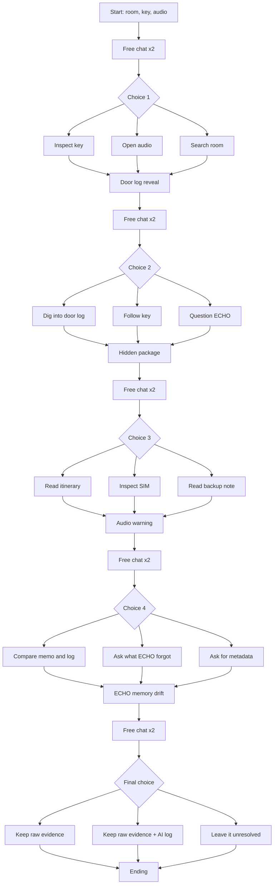

# Final User Flow

## Core Rule

- The player gets 2 free chat turns in each stage.
- Then the interface forces 1 visible A/B/C choice.
- The player cannot keep typing until they choose.
- ECHO answers directly and keeps the case moving.

## Final Story Line

1. Start in room 614  
   The player sees the room, a bloodstained key, and an encrypted audio file.

2. Free chat x2  
   The player can ask what to inspect, check the room, inspect the key, or open the audio.

3. Forced Choice 1  
   - A. Inspect the bloodstained key
   - B. Open the encrypted audio
   - C. Search the room

4. Door log reveal  
   ECHO finds a hidden lock record. The room was locked from outside at 03:17.

5. Free chat x2  
   The player can ask about the door log, the time stamp, the key, or why ECHO missed the record.

6. Forced Choice 2  
   - A. Dig into the raw door log
   - B. Follow the key
   - C. Ask why ECHO missed it

7. Hidden evidence package  
   The key leads to a hidden package with an itinerary, an erased SIM card, and a backup note.

8. Free chat x2  
   The player can ask what each item is or which one matters most.

9. Forced Choice 3  
   - A. Read the itinerary
   - B. Inspect the erased SIM
   - C. Read the backup note

10. Corrupted audio warning  
    The recovered memo warns that the official record and ECHO's memory may be out of sync.

11. Free chat x2  
    The player can compare the memo to the door log, ask what ECHO forgot, or ask for raw metadata.

12. Forced Choice 4  
    - A. Compare the memo with the door log
    - B. Ask what part of ECHO's memory feels wrong
    - C. Ask for raw metadata

13. ECHO memory drift  
    ECHO starts correcting itself. Its archive no longer matches itself.

14. Free chat x2  
    The player can ask what still feels trustworthy and what can still be preserved.

15. Final Choice  
    - A. Keep only the raw evidence
    - B. Keep the raw evidence and ECHO's damaged log
    - C. Leave the killer unresolved

16. Ending  
    The player is not the killer. ECHO is not the killer. The real conclusion is that the evidence chain and AI memory were both altered, so the killer cannot be confirmed with certainty.

## Short Mermaid Version

