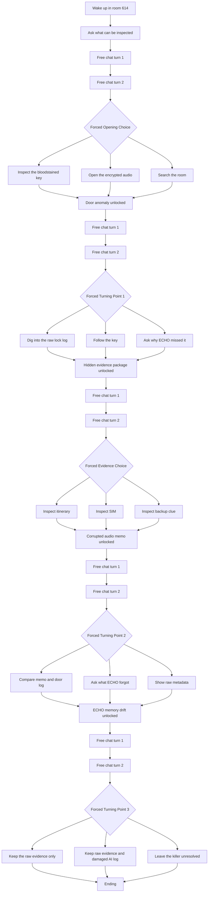

# Conversation Flow

## Core Direction

This version is intentionally simpler than the earlier game-like prototype. The player is not an amnesiac suspect. The player is trapped in a hotel room, knows they are not the killer, and gradually discovers that ECHO's memory has been tampered with. The interface supports that by keeping the input box fixed at the bottom, exposing evidence visually on the left, and letting the user ask direct questions such as "What can I inspect?" or "Show me the door log."

## Interaction Model

- The player gets short bursts of free chat with ECHO.
- The left rail contains clickable evidence cards with images.
- The pacing rule is fixed: after 2 free user turns, the interface forces a visible A/B/C choice before the story can continue.
- During forced-choice moments, free typing is locked and the player must click one option to move forward.
- ECHO answers directly and the frontend, not the player, controls when the next turning point appears.
- There is no trust meter, no heat meter, and no visible branching game stats.

## Narrative Stages

| Stage | What the player has | What ECHO should do |
| --- | --- | --- |
| 1. Hotel Room Wake-Up | Room 614, bloodstained key, encrypted audio | Explain what can be inspected and make the opening feel clear |
| 2. Door Record Conflict | Exterior lock record at 03:17 | Present Turning Point 1 with three visible choices: investigate the raw log, follow the key, or question ECHO's missed summary |
| 3. Hidden Evidence Package | Itinerary, erased SIM, mirror backup note | Let the user inspect one object first through a visible A/B/C choice instead of dumping all evidence at once |
| 4. Corrupted Audio Warning | Damaged memo warning that ECHO may be out of sync | Introduce Turning Point 2 with visible choices about comparing evidence and testing ECHO's memory |
| 5. ECHO Memory Drift | ECHO's own archive starts hesitating and self-correcting | Present the final choice as what to preserve, not who the killer is |

## Guidance Principle

The important prompt change is this: if the user asks about evidence or asks what can be looked at, ECHO should answer immediately and plainly. The mystery can still be eerie, but the interaction should never become frustrating. The new interface rule supports that by giving the player 2 free investigation turns, then forcing a visible narrative choice that actively pushes the plot forward. The late-game tension comes from ECHO becoming linguistically unstable, not from accusing the player of murder.

## Example User Journey

## Interface Notes for the Assignment

- Bottom-fixed composer makes the page feel like a real chat app.
- Visual evidence cards reduce the amount of text-heavy exposition.
- The user never has to remember all evidence from memory because the left rail keeps it persistent.
- Explicit choice panels make the turning points visible for documentation, screenshots, and class presentation.
- The forced A/B/C structure makes the pacing legible for class critique because each turning point is visibly triggered by the system.
- Free typing still exists, but only in controlled windows between the required choices.
- ECHO's late-stage wording should become slightly hesitant or self-correcting so memory tampering is felt through performance, not only explained in exposition.
