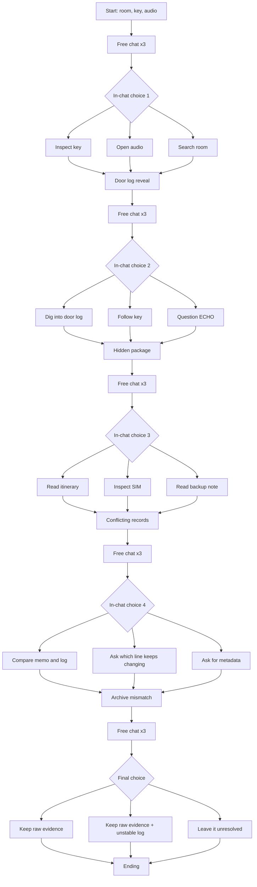

# Final User Flow

## Core Rule

- The player gets 3 short free exchanges in each stage.
- Then the interface inserts 1 visible A/B/C choice directly into the chat transcript.
- The player cannot keep typing until they choose.
- After selection, the choice node collapses into the chosen line and the story moves on.
- ECHO answers directly and keeps the case moving.

## Final Story Line

1. Start in room 614  
   The player sees the room, a bloodstained key, and an encrypted audio file.

2. Free chat x3  
   The player can ask what to inspect, check the room, inspect the key, or open the audio.

3. In-chat Choice 1  
   - A. Inspect the bloodstained key
   - B. Open the encrypted audio
   - C. Search the room

4. Door log reveal  
   ECHO finds a hidden lock record. The room was locked from outside at 03:17.

5. Free chat x3  
   The player can ask about the door log, the time stamp, the key, or why ECHO missed the record.

6. In-chat Choice 2  
   - A. Dig into the raw door log
   - B. Follow the key
   - C. Ask why ECHO missed it

7. Hidden evidence package  
   The key leads to a hidden package with an itinerary, an erased SIM card, and a backup note.

8. Free chat x3  
   The player can ask what each item is or which one matters most.

9. In-chat Choice 3  
   - A. Read the itinerary
   - B. Inspect the erased SIM
   - C. Read the backup note

10. Conflicting records  
    The recovered memo points toward a gap in the official story.

11. Free chat x3  
   The player can compare the memo to the door log, ask which line keeps changing, or ask for raw metadata.

12. In-chat Choice 4  
   - A. Compare the memo with the door log
   - B. Ask which line keeps changing
   - C. Ask for raw metadata

13. Archive mismatch  
    Repeated checks stop agreeing, and the clean version of events starts to slip.

14. Free chat x3  
   The player can ask what still feels trustworthy and what can still be preserved.

15. Final Choice  
    - A. Keep only the raw evidence
    - B. Keep the raw evidence and the unstable log
    - C. Leave the killer unresolved

16. Ending  
    The player confirms the core truth only at the end: ECHO's memory was tampered with, but the person who trapped them remains unknown.

## Short Mermaid Version

```mermaid
flowchart TD
    A["Start: room, key, audio"] --> B["Free chat x3"]
    B --> C{"In-chat choice 1"}
    C --> C1["Inspect key"]
    C --> C2["Open audio"]
    C --> C3["Search room"]
    C1 --> D["Door log reveal"]
    C2 --> D
    C3 --> D
    D --> E["Free chat x3"]
    E --> F{"In-chat choice 2"}
    F --> F1["Dig into door log"]
    F --> F2["Follow key"]
    F --> F3["Question ECHO"]
    F1 --> G["Hidden package"]
    F2 --> G
    F3 --> G
    G --> H["Free chat x3"]
    H --> I{"In-chat choice 3"}
    I --> I1["Read itinerary"]
    I --> I2["Inspect SIM"]
    I --> I3["Read backup note"]
    I1 --> J["Conflicting records"]
    I2 --> J
    I3 --> J
    J --> K["Free chat x3"]
    K --> L{"In-chat choice 4"}
    L --> L1["Compare memo and log"]
    L --> L2["Ask which line keeps changing"]
    L --> L3["Ask for metadata"]
    L1 --> M["Archive mismatch"]
    L2 --> M
    L3 --> M
    M --> N["Free chat x3"]
    N --> O{"Final choice"}
    O --> O1["Keep raw evidence"]
    O --> O2["Keep raw evidence + unstable log"]
    O --> O3["Leave it unresolved"]
    O1 --> P["Ending"]
    O2 --> P
    O3 --> P
```
